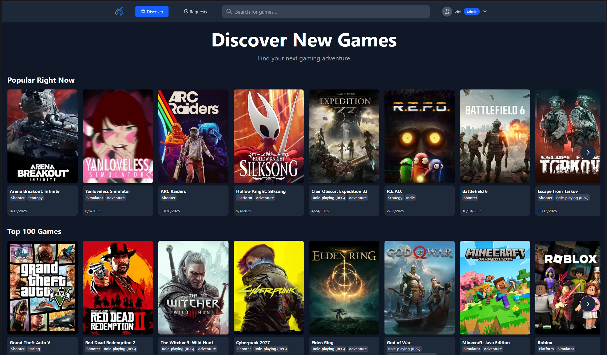
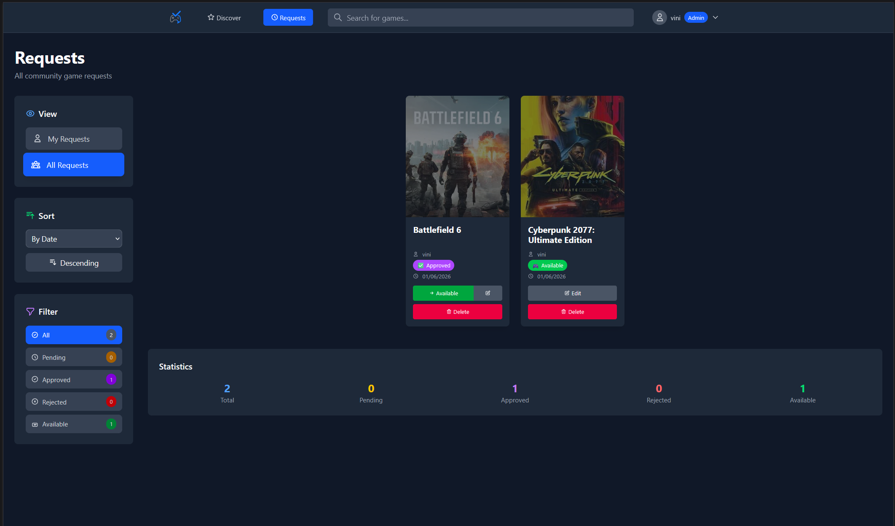
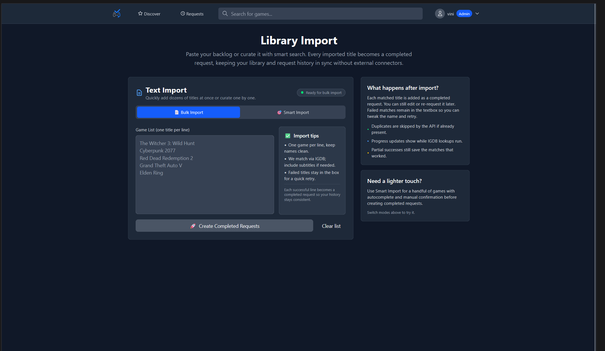

# GameRequest

A self-hosted game request management system. Users can search for games, create requests, and admins can manage the game library.

## Features

- 🎮 Search games via IGDB API
- 📝 User request system with status tracking
- 👥 Multi-user support with admin controls
- 🎨 Modern web interface
- 🔒 Secure authentication
- 🐳 Easy Docker deployment
- 📣 Telegram notification support (instant alerts for new requests and approvals)

## Screenshots

<figure>
   
   <figcaption>
       <strong>Discover</strong> view highlights featured games and trending requests at a glance.
   </figcaption>
</figure>

<br>

<figure>
   
   <figcaption>
       <strong>Requests</strong> view lists every submission with status chips, filters, and quick actions for admins.
   </figcaption>
</figure>

<figure>
   
   <figcaption>
      <strong>Library Import</strong> lets admins bulk-load titles and metadata from curated spreadsheets.
   </figcaption>
</figure>

<br>

## Installation

### Prerequisites

- Docker and Docker Compose installed
- IGDB API credentials (free from https://api.igdb.com/)

### Quick Start

1. **Get IGDB credentials**
   
   Follow the ["Obtaining IGDB Credentials"](#obtaining-igdb-credentials) section below to create a Twitch Developer application and fetch the IGDB Client ID and Client Secret that will power the game search features.

2. **Download docker-compose.yml**
   
   ```bash
   curl -O https://raw.githubusercontent.com/DeVini2111/GameRequest/main/docker-compose.yml
   ```

   Source code of docker-compose file:
   ```yml
   services:
      db:
         image: postgres:16-alpine
         container_name: gamerequest-db
         restart: unless-stopped
         healthcheck:
            test: ["CMD-SHELL", "pg_isready -U gamerequest"]
            interval: 5s
            timeout: 3s
            retries: 5
         environment:
            POSTGRES_USER: gamerequest
            # Cache credentials
            POSTGRES_PASSWORD: changeme_secure_password
            POSTGRES_DB: gamerequest
         volumes:
            - postgres_data:/var/lib/postgresql/data
         networks:
            - gamerequest_network

      redis:
         image: redis:7-alpine
         container_name: gamerequest-redis
         restart: unless-stopped
         volumes:
            - redis_data:/data
         networks:
            - gamerequest_network

      app:
         image: ghcr.io/devini2111/gamerequest:latest
         container_name: gamerequest
         restart: unless-stopped
         depends_on:
            db:
               condition: service_healthy
            redis:
               condition: service_started
         environment:
            # Database credentials
            DB_PASSWORD: changeme_secure_password
            
            # IGDB API credentials - get from https://api.igdb.com/
            IGDB_CLIENT_ID: your_igdb_client_id_here
            IGDB_CLIENT_SECRET: your_igdb_client_secret_here
            
            # CORS origins (optional, "*" allows all)
            CORS_ORIGINS: "*"
         ports:
            - "8075:8000"
         volumes:
            - ./logs:/app/logs
         networks:
            - gamerequest_network
   volumes:
      postgres_data:
      redis_data:

   networks:
      gamerequest_network:
   ```

3. **Edit the configuration**
   
   Open `docker-compose.yml` and change these 3 values:
   
   ```yaml
   DB_PASSWORD: your_secure_password_here
   POSTGRES_PASSWORD: changeme_secure_password
   IGDB_CLIENT_ID: your_igdb_client_id
   IGDB_CLIENT_SECRET: your_igdb_client_secret
   ```

   The value `DB_PASSWORD` must match `POSTGRES_PASSWORD`, because the app uses it to talk to PostgreSQL—update both before you bring the stack up.

4. **Start the service**
   
   ```bash
   docker-compose up -d
   ```

5. **Complete the in-app setup**
   
   Open http://localhost:8075 in your browser, follow the on-screen wizard to create the initial admin user, and you are ready to go—no CLI admin creation needed.

## Configuration Reference

| Variable | Where it lives | Required | Description | Default |
|----------|----------------|----------|-------------|---------|
| `POSTGRES_USER` | `db.environment` | Yes | Database superuser created at boot | `gamerequest` |
| `POSTGRES_PASSWORD` | `db.environment` | Yes | Password for the above user and main database | `changeme_secure_password` |
| `POSTGRES_DB` | `db.environment` | Yes | Default database name | `gamerequest` |
| `DB_PASSWORD` | `app.environment` | Yes | Password the API uses to connect to PostgreSQL (must equal `POSTGRES_PASSWORD`) | `changeme_secure_password` |
| `IGDB_CLIENT_ID` | `app.environment` | Yes | Twitch/IGDB client ID for search requests | *(none)* |
| `IGDB_CLIENT_SECRET` | `app.environment` | Yes | Twitch/IGDB secret paired with the client ID | *(none)* |
| `CORS_ORIGINS` | `app.environment` | No | Comma-separated origins allowed to call the API | `*` |

Named volumes (`postgres_data`, `redis_data`) persist database/cache data, and the `gamerequest_network` bridge isolates the stack from other containers. Delete the volumes if you want a fully clean slate.

## Obtaining IGDB Credentials

1. **Create a Twitch Developer account**
   - Visit https://dev.twitch.tv and sign in with (or create) a Twitch account.
   - Accept the Developer Agreement when prompted.
2. **Register a new application**
   - In the dashboard, click **Applications → Register Your Application**.
   - Set any name (e.g., `GameRequest`), choose "Website Integration" as the category, and enter a placeholder OAuth redirect URL such as `https://example.com` (not used by GameRequest).
   - Submit the form; the dashboard now shows your app with a **Client ID**—copy it into `docker-compose.yml`.
3. **Generate a Client Secret**
   - From the same application details page, click **New Secret**. Twitch will display the **Client Secret** once; copy it immediately into `docker-compose.yml`.
4. **Enable IGDB access**
   - Visit https://api.igdb.com, sign in with the same Twitch account, and link the application you just created. IGDB automatically inherits the Client ID/Secret from Twitch.
5. **Update `docker-compose.yml`**
   - Paste the copied Client ID and Secret into the `IGDB_CLIENT_ID` and `IGDB_CLIENT_SECRET` fields, then run `docker compose up -d`.

## Ports

- **8075** - Web interface and API (mapped to container port 8000)

## Updates & Maintenance

1. Pull the newest containers: `docker compose pull`.
2. Restart with the fresh images: `docker compose up -d`.
3. Review logs for a minute (`docker compose logs -f app`) to ensure the FastAPI service starts without tracebacks.

## Troubleshooting

- **App container exits immediately** – confirm the IGDB credentials and `DB_PASSWORD` are set; missing values cause the startup validation to fail.
- **Cannot connect to database** – run `docker compose logs db` to check the PostgreSQL health check. If the container keeps restarting, wipe `postgres_data` or fix permissions on the host directory.
- **API rejects browser requests** – tighten or loosen `CORS_ORIGINS` to suit your frontend domain list and restart the stack.
- **Need more insight** – tail `/app/logs` inside the `app` container (or bind-mount `./logs`) for request and exception traces.

## Support

Questions or bugs? Open an issue at https://github.com/DeVini2111/GameRequest-Tool/issues.

## License

GameRequest is released under the GPL-3.0 License. See [LICENSE](LICENSE) for the full terms.
